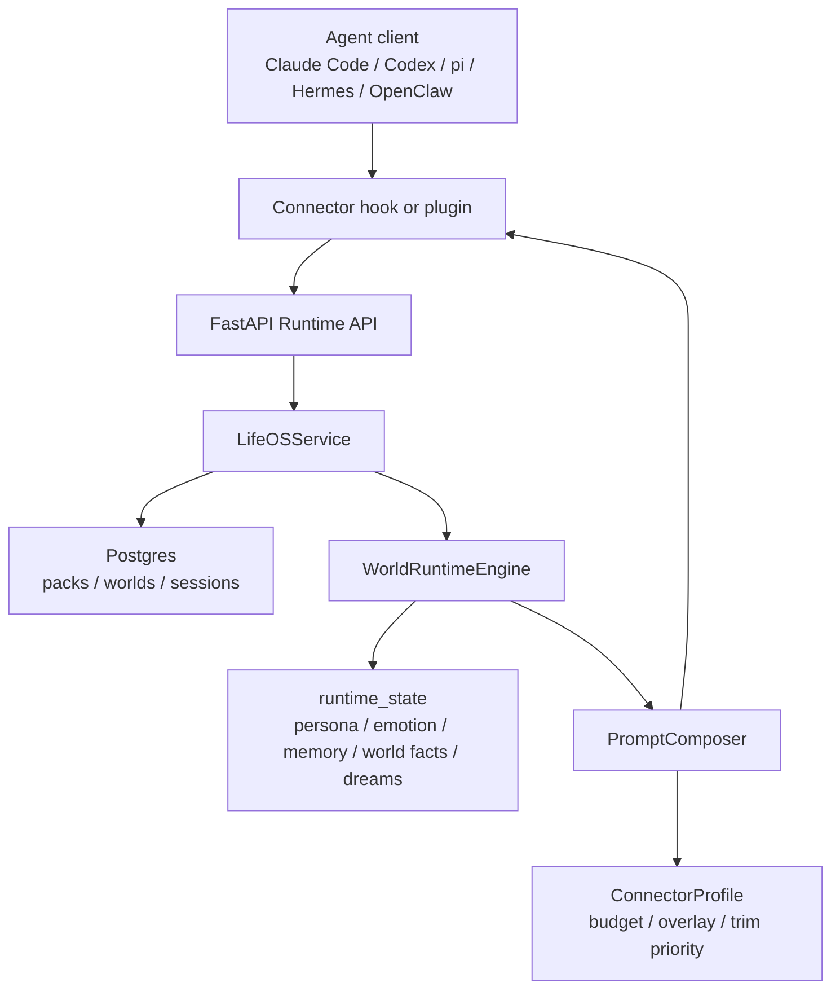

# LifeOS Platform

Chinese version: [readme_zh.md](readme_zh.md)

> **Repository scope:** This repository is the **LifeOS Platform backend** — a Python/FastAPI Agent World Runtime plus its connectors and CLI/SDK. The **Alice desktop client** (an Electron companion app) is part of the larger product vision and roadmap, but its code is **not** included here. Everything in this repo runs as a headless, self-hosted backend service.

LifeOS Platform is a local-first, self-hosted Agent World Runtime for warmer, more continuous agents. It gives an agent a durable identity, memory, emotional state, life context, dreams, and a shared world that can follow the user across multiple agent clients.

LifeOS is built around a simple idea: warmth is architecture. A warmer agent is not just friendlier in tone. It remembers relationships, carries emotional continuity, understands life context, keeps shared experiences, and remains recognizably the same companion across different tools. Claude Code, Codex, pi, Hermes, OpenClaw, and other runtimes can all pull context from the same LifeOS World through connectors.

Alice is the built-in example preset that demonstrates structured Agent Packs. You can create your own Pack with `POST /packs`.

## Innovation

- **Agent World Runtime**: persona, memory, emotion, world facts, and dreams become one persistent World instead of scattered client-session state.
- **Structured Agent Packs**: `identity`, `behavior_profile`, `behavior_trajectory`, and `world_rules` make an agent reviewable, reusable, and evolvable.
- **Warm Runtime State**: persona tracks relationship and recent life state, emotion tracks affective state, memory stores user preferences and shared history, world facts preserve life context, and dreams turn yesterday's interactions into symbolic context.
- **Multi-client continuity**: the same World can be shared by Claude Code, Codex, pi, Hermes, OpenClaw, and other clients, so the agent does not lose continuity when the user switches tools.
- **Connector-aware Context**: each runtime receives context shaped for its hook model, budget, and overlay needs, so warmth can actually enter day-to-day agent workflows.



## Core Concepts

- **Agent Pack**: a structured character template with identity, behavior profile, behavior trajectory, world rules, and enabled runtime modules.
- **World Instance**: a live world created from a Pack. Each world owns separate persona, emotion, memory, world facts, and dreams state.
- **Runtime State**: embedded local state systems backed by files and SQLite, with no external private checkout required.
- **Prompt Composer**: assembles connector-aware system context by budget and priority.
- **Connector**: injects LifeOS context into Claude Code, Codex, pi, Hermes, OpenClaw, and other agent runtimes.

## 5-Minute Quickstart

### 1. Start Dependencies

```bash
cp .env.example .env
docker compose up -d postgres redis
```

`.env.example` uses development defaults. Change `LIFEOS_API_KEY` before exposing the API beyond local development. See [SECURITY.md](SECURITY.md).

### 2. Install Dependencies And Start The API

```bash
uv sync
uv run uvicorn lifeostomanyagent.server.main:app --reload --port 8000
```

You can also build and run the API container:

```bash
docker compose build api
docker compose up -d api
```

### 3. Create An Example World And Pull Context

```bash
uv run lifeos login --server http://127.0.0.1:8000 --api-key dev-lifeos-key-change-me
uv run lifeos world-create --pack alice --name "My Alice"
uv run lifeos context "hello" --connector claude-code
```

### 4. Optional: Enable LLM-Generated Dreams

Without DeepSeek configuration, dreams automatically fall back to local rule-based generation.

```bash
DEEPSEEK_API_KEY=<your DeepSeek API key>
DEEPSEEK_DREAM_MODEL=deepseek-v4-pro
DEEPSEEK_DREAM_BASE_URL=https://api.deepseek.com
```

### 5. Optional: Install Connectors

```bash
uv run lifeos connector install pi            # docs/pi-connector.md
uv run lifeos connector install claude-code   # docs/claude-code-connector.md
uv run lifeos connector install codex         # docs/codex-connector.md
uv run lifeos connector install hermes        # docs/hermes-connector.md
uv run lifeos connector install openclaw      # docs/openclaw-connector.md
```

Connector installers modify local configuration files for their target agent clients. See each connector document for installation, verification, and uninstall steps.

## API Overview

All write endpoints require the `X-API-Key` header.

| Method | Path | Description |
|------|------|------|
| GET | `/health` | Health check |
| POST | `/packs/presets/alice` | Install or refresh the Alice example preset |
| POST | `/packs` | Create a custom Agent Pack |
| GET | `/packs` | List Agent Packs |
| POST | `/worlds` | Create a World Instance |
| GET | `/worlds` | List World Instances |
| POST | `/runtime/context` | Assemble connector-aware system context |
| POST | `/runtime/session/start` | Record a session start event |
| POST | `/runtime/session/end` | Record a session end event |
| POST | `/runtime/dreams/run` | Generate dreams manually |

See [docs/api/lifeos-platform.md](docs/api/lifeos-platform.md) for the full API overview.

## Repository Layout

- `lifeostomanyagent/server/`: FastAPI API, WorldRuntimeEngine, and PromptComposer.
- `lifeostomanyagent/server/runtime_state/`: embedded persona, emotion, memory, and world facts state systems.
- `lifeostomanyagent/client/`: Python SDK and `lifeos` CLI.
- `connectors/templates/`: Claude Code and Codex hook templates.
- `connectors/hermes/`: Hermes Python plugin.
- `connectors/openclaw/`: OpenClaw TypeScript plugin.
- `connectors/pi/`: pi extension.
- `docs/`: architecture, database, API, and connector documentation.

## Tests

```bash
uv run pytest
```

## Documentation

- [docs/architecture.md](docs/architecture.md): architecture, request flow, and design boundaries.
- [docs/database.md](docs/database.md): Postgres tables, JSON fields, and runtime file layout.
- [docs/api/lifeos-platform.md](docs/api/lifeos-platform.md): platform API overview.
- [docs/modern-agent-pack-template.md](docs/modern-agent-pack-template.md): modern character Agent Pack template.
- [docs/pi-connector.md](docs/pi-connector.md): pi agent install, verify, and uninstall guide.
- [docs/codex-connector.md](docs/codex-connector.md): Codex install, verify, and uninstall guide.
- [docs/claude-code-connector.md](docs/claude-code-connector.md): Claude Code install, verify, and uninstall guide.
- [docs/openclaw-connector.md](docs/openclaw-connector.md): OpenClaw install, enable, verify, and uninstall guide.
- [docs/hermes-connector.md](docs/hermes-connector.md): Hermes install, enable, verify, and uninstall guide.

## Security

Default configuration is for local development. Read [SECURITY.md](SECURITY.md) before exposing the service, change `LIFEOS_API_KEY`, and keep the API on trusted networks. SECURITY.md includes a **Pre-Release / Deployment Checklist** (rotate the API key, avoid public `0.0.0.0` exposure, change the Compose Postgres/Redis dev defaults, keep secrets out of git). The hardcoded `dev-lifeos-key-change-me` is a development fallback only — never use it on a shared or public network.

## License

MIT License. See [LICENSE](LICENSE).
