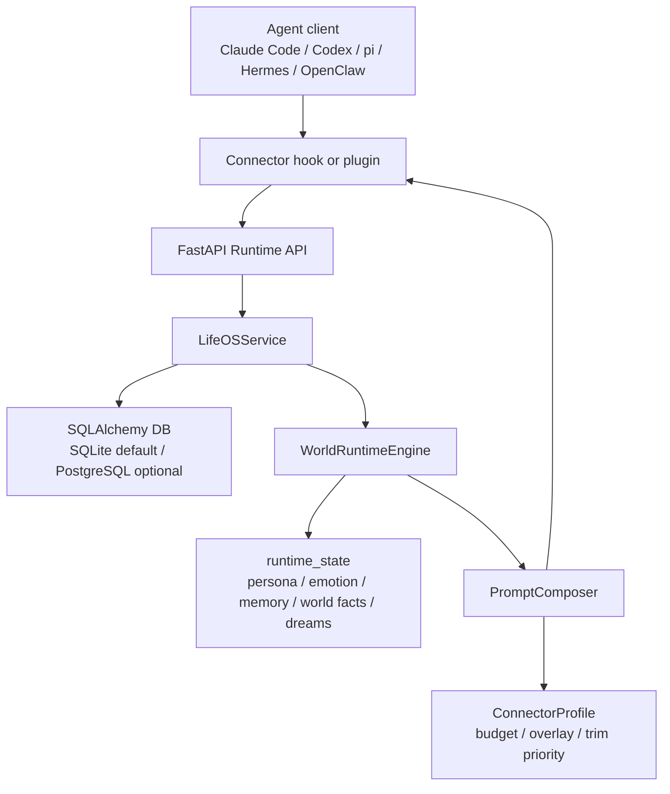

# LifeOS Architecture

LifeOS Platform is a local-first Agent World Runtime. It separates an agent's durable world state from any single chat client, then exposes that state through a small API and connector-specific context assembly.

## Design Goals

- Keep persona, emotion, memory, world facts, and dreams persistent across agent clients.
- Make agent identity structured and reviewable instead of one large prompt string.
- Let each connector receive context in the format and budget it can tolerate.
- Keep the default deployment self-hosted and understandable.

## System Overview

## Core Objects

### Agent Pack

An Agent Pack is the template for a character or assistant. The preferred shape is structured:

- `identity`: name, backstory, relationship stance, core values.
- `behavior_profile`: speech style, forbidden patterns, work habits, addressing rules.
- `behavior_trajectory`: milestones, proactive style, reaction patterns.
- `world_rules`: timezone, work hours, locations, custom facts.
- `runtime_modules`: which runtime state systems are enabled.

Legacy `base_system_prompt` remains supported for migration, but new packs should use structured fields.

### World Instance

A World Instance is a live copy of a Pack. Multiple worlds can share the same Pack but keep separate runtime state. Pack metadata and runtime state live in the same SQLAlchemy database: SQLite by default, or PostgreSQL when `DATABASE_URL` points to Postgres.

### Runtime State

The embedded `lifeostomanyagent/server/runtime_state/` package contains the minimum state systems needed by `WorldRuntimeEngine`:

- `persona_system`: relationship, mood-like persona state, interests, journal.
- `emotion_system`: emotion variables and behavior constraints.
- `memory_system`: user memory entries and prompt block rendering.
- `world_engine`: SQL-backed world facts, events, purchases, venues.
- `dreams`: LifeOS-native dream seed collection and dream prompt block generation.

The runtime state package is copied into this repository and does not require an external private checkout.

## Request Flow

1. A connector receives a user prompt or session event.
2. The connector calls LifeOS API with `world_id`, `connector_id`, `session_id`, and user message.
3. `LifeOSService` loads the world metadata and Pack from the configured SQL database.
4. `WorldRuntimeEngine` reads enabled state modules from SQL-backed runtime stores.
5. `LifeOSService` resolves the interaction intent. By default, deterministic rules only allow clear chitchat / companionship turns to receive LifeOS context; task-like or unknown input returns an empty context. `LIFEOS_INTENT_CLASSIFIER=llm` enables DeepSeek-based intent classification with rule fallback.
6. For chitchat turns, `PromptComposer` renders ordered context blocks and applies the connector budget.
7. The connector injects the returned `system` block only when `injected=true`.

## Context Block Order

The default order is:

1. platform guardrails
2. agent identity
3. behavior profile
4. behavior trajectory
5. world rules
6. persona state
7. emotion state
8. dream context
9. user memory
10. world facts
11. connector overlay
12. current user message

Protected runtime blocks are preserved during trimming where possible, while lower-priority static blocks can be dropped or compacted when a connector has a small budget.

## Intent Gate

`/runtime/context` is guarded by an intent classifier so LifeOS persona, emotion, memory, dreams, and world state are injected only for clear chitchat / companionship turns.

- `interaction_intent=auto` uses the configured classifier.
- `interaction_intent=chitchat` or `task` explicitly overrides classification.
- `LIFEOS_INTENT_CLASSIFIER=off` disables the gate and treats every auto request as `chitchat`, restoring always-inject behavior.
- `LIFEOS_INTENT_CLASSIFIER=rules` is the default and prefers `task` for any task signal or unknown message.
- `LIFEOS_INTENT_CLASSIFIER=llm` uses DeepSeek for classification, then falls back to rules if the model is unavailable, low-confidence, or returns invalid JSON.
- Task turns return `system=""`, `injected=false`, and no context blocks.

## Connector Strategy

Connectors are intentionally thin. They should:

- Load local LifeOS config from `~/.lifeos/config.json` or environment variables.
- Notify LifeOS about session and turn events.
- Pull `/runtime/context` before model execution.
- Merge the returned context according to the target runtime's supported hook shape when `injected=true`.

Connector-specific playbooks belong in overlays, not in the core Pack model.

## Why Not LangChain, AutoGen, Or A Plain Prompt Template

LifeOS is not a model orchestration graph. It does not try to own tool calling, planning, or multi-agent execution. Those belong to the target agent runtime.

LifeOS owns the persistent world layer:

- structured agent identity
- local runtime state
- connector-aware context assembly
- repeatable Pack and World APIs

This lets the same world follow a user across different agent clients without rewriting each client as a LifeOS-specific app.

## Current Boundaries

- Authentication is a single shared API key.
- Database schema is created with SQLAlchemy `create_all`; there is no Alembic migration layer yet.
- 陈远 is an example preset, not a required product identity.
- The pi overlay is intentionally specific and should be treated as an example overlay rather than a generic runtime contract.
