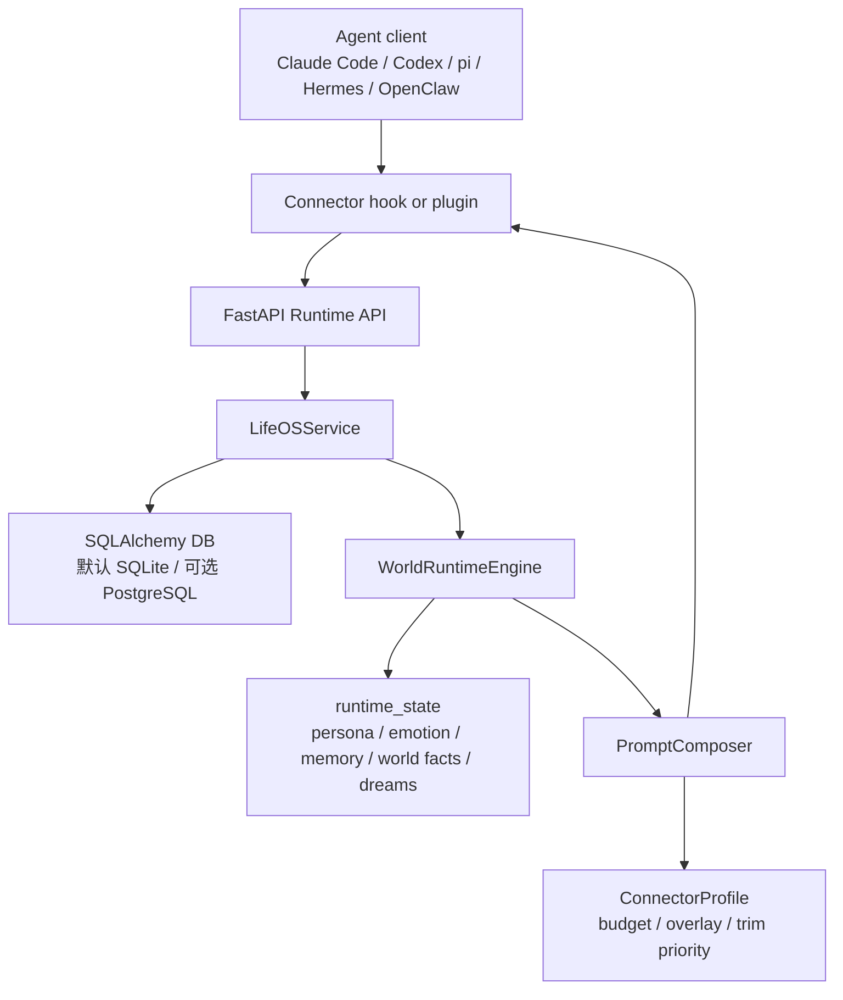

# LifeOS Platform

English version: [README.md](README.md)

LifeOS Platform 是一个 local-first、自托管的 Agent World Runtime，用来构建更有温度、更有连续性的 Agent。它给 Agent 一个持久身份、记忆、情绪状态、生活背景、梦境和可跨多个 Agent 客户端共享的世界。

LifeOS 的目标是让 Agent 更有温度。温度不是多说几句亲切话，而是它能记得关系、承接情绪、理解生活背景、保留共同经历，并且在不同工具里仍然像同一个持续存在的伙伴。Claude Code、Codex、pi、Hermes、OpenClaw 等不同运行时都可以通过 Connector 拉取同一个 World 的上下文。

Alice 是仓库自带的 example preset，用来展示结构化 Agent Pack 的能力；你可以通过 `POST /packs` 创建自己的 Pack。

## 创新点

- **Agent World Runtime**：把人格、记忆、情绪、世界事实和梦境做成一个持续存在的 World，而不是散落在某个客户端会话里。
- **结构化 Agent Pack**：用 `identity`、`behavior_profile`、`behavior_trajectory`、`world_rules` 描述一个 Agent，让人物设定可以被审阅、复用和演化。
- **有温度的 Runtime State**：persona 记录关系与近况，emotion 记录情绪状态，memory 保存用户偏好与共同经历，world facts 保存生活世界，dreams 把昨日互动整理成象征性上下文。
- **多客户端一致性**：同一个 World 可以被 Claude Code、Codex、pi、Hermes、OpenClaw 等客户端共享，Agent 不会因为换工具就失去连续性。
- **Connector-aware Context**：根据不同 agent runtime 的能力、预算和 hook 形态组装上下文，让“有温度”能实际注入到工作流里。



## 核心概念

- **Agent Pack**：结构化人物模板，包含身份、行为画像、行为轨迹、世界规则和启用的 runtime 模块。
- **World Instance**：基于 Pack 创建的独立世界，每个 world 有自己的 persona、emotion、memory、world facts 和 dreams 状态。
- **Runtime State**：仓库内嵌的状态子系统，读写当前配置的 SQL 数据库，不依赖外部私有目录。
- **Prompt Composer**：按 connector、预算和优先级组装 system context。
- **Connector**：把 LifeOS context 注入到 Claude Code、Codex、pi、Hermes、OpenClaw 等 agent runtime。

## Roadmap

LifeOS Platform 已经开源，后续会优先把 runtime 做到可见、可编辑、可安全运行，再逐步扩展到更丰富的多 Agent 世界。

1. **Server 上线与可视化控制台**

   推进 server 走向可部署产品，并构建 Web 控制台，用来查看 Worlds、Agent Packs、persona 状态、memory、emotion、dreams、world facts 和 connector context 注入结果。目标是让隐藏在后端里的 runtime state 变得可观察，而不是只能从 API 响应里猜系统发生了什么。

2. **角色创建与 Agent Pack 市场雏形**

   提供基于模板的角色创建流程，让用户可以从结构化字段创建 Agent：身份、关系定位、说话风格、行为边界、世界规则和启用的 runtime 模块。后续可以支持 Pack 导入/导出、版本管理、精选预设和轻量社区市场，让 Agent Pack 可以复用和分享。

3. **多角色 World 与 AI 社会系统**

   从“一个用户 + 一个角色”的模型升级到一个 World 中存在多个 Agent。第一步会先做轻量事件总线、角色关系图和共享世界时间线；更后续再探索日程、观察、反思、角色间对话、群体事件，以及类似 Stanford Smallville 的社会模拟能力。

4. **更丰富的角色数据系统**

   在现有 persona、emotion、memory、world facts 和 dreams 之外，继续扩展角色数据层。候选方向包括长期关系曲线、偏好置信度、生活资产、地点熟悉度、共同经历、角色私有日记、社交关系、目标与计划。

5. **运行时观测与调试系统**

   为每次 `/runtime/context` 调用提供可追踪解释：为什么注入或不注入 context，intent gate 如何判断 chitchat/task，哪些 context blocks 被保留或裁剪，session/turn 结束后角色状态如何变化。这会让 connector 行为更容易调试和迭代。

6. **产品级部署与安全**

   从单共享 API key 逐步升级到用户/项目隔离、world 权限、数据库迁移、备份恢复、部署文档和更严格的公开部署检查清单。这些能力是 LifeOS 从本地可信环境走向公开部署前必须补齐的基础设施。

## 5 分钟 Quickstart

### 1. 准备本地配置

```bash
cp .env.example .env
```

核心存储默认使用 `{LIFEOS_DATA_ROOT}/lifeos.sqlite3`，本地使用不需要额外数据库服务。公开部署或联网使用前，请修改 `LIFEOS_API_KEY`，详见 [SECURITY.md](SECURITY.md)。

### 2. 安装依赖并启动 API

```bash
uv sync
uv run uvicorn lifeostomanyagent.server.main:app --reload --port 8000
```

也可以直接构建 API 镜像；默认会把 SQLite 数据保存在 `lifeos_data` volume 中：

```bash
docker compose build api
docker compose up -d api
```

### 3. 创建示例 World 并拉取 context

```bash
uv run lifeos login --server http://127.0.0.1:8000 --api-key dev-lifeos-key-change-me
uv run lifeos world-create --pack alice --name "我的 Alice"
uv run lifeos context "你好" --connector claude-code
```

### 4. 可选：启用梦境模块的 LLM 生成

未配置 DeepSeek 时，dreams 会自动回退到本地规则生成。

```bash
DEEPSEEK_API_KEY=<your DeepSeek API key>
DEEPSEEK_DREAM_MODEL=deepseek-v4-pro
DEEPSEEK_DREAM_BASE_URL=https://api.deepseek.com
```

### 5. 可选：安装 Connector

```bash
uv run lifeos connector install pi            # docs/pi-connector.md
uv run lifeos connector install claude-code   # docs/claude-code-connector.md
uv run lifeos connector install codex         # docs/codex-connector.md
uv run lifeos connector install hermes        # docs/hermes-connector.md
uv run lifeos connector install openclaw      # docs/openclaw-connector.md
```

Connector installer 会修改对应 agent 客户端的本地配置文件。安装、验证和卸载步骤见各 connector 文档。

## API 概览

所有写接口需 Header：`X-API-Key`。

| 方法 | 路径 | 说明 |
|------|------|------|
| GET | `/health` | 健康检查 |
| POST | `/packs/presets/alice` | 安装/刷新 Alice 示例 preset |
| POST | `/packs` | 创建自定义 Agent Pack |
| GET | `/packs` | 列出 Agent Pack |
| POST | `/worlds` | 创建 World Instance |
| GET | `/worlds` | 列出 World Instance |
| POST | `/runtime/context` | 组装 connector-aware system context |
| POST | `/runtime/session/start` | 会话开始事件 |
| POST | `/runtime/session/end` | 会话结束事件 |
| POST | `/runtime/dreams/run` | 手动生成梦境 |

完整接口说明见 [docs/api/lifeos-platform.md](docs/api/lifeos-platform.md)。

## 目录

- `lifeostomanyagent/server/`：FastAPI API、WorldRuntimeEngine、PromptComposer。
- `lifeostomanyagent/server/runtime_state/`：内嵌 persona / emotion / memory / world facts 状态子系统。
- `lifeostomanyagent/client/`：Python SDK 与 `lifeos` CLI。
- `connectors/templates/`：Claude Code / Codex hook 模板。
- `connectors/hermes/`：Hermes Python Plugin。
- `connectors/openclaw/`：OpenClaw TypeScript Plugin。
- `connectors/pi/`：pi Extension。
- `docs/`：架构、数据库、API 和 connector 文档。

## 测试

```bash
uv run pytest
```

## 文档

- [docs/architecture.md](docs/architecture.md)：架构、数据流和设计边界。
- [docs/database.md](docs/database.md)：SQLite/PostgreSQL 存储、SQL 表结构、JSON 字段和旧 runtime 导入。
- [docs/api/lifeos-platform.md](docs/api/lifeos-platform.md)：平台 API 总览。
- [docs/modern-agent-pack-template.md](docs/modern-agent-pack-template.md)：现代人物 Agent Pack 双层生成模板。
- [docs/pi-connector.md](docs/pi-connector.md)：pi agent 安装 / 验证 / 卸载。
- [docs/codex-connector.md](docs/codex-connector.md)：Codex 安装 / 验证 / 卸载。
- [docs/claude-code-connector.md](docs/claude-code-connector.md)：Claude Code 安装 / 验证 / 卸载。
- [docs/openclaw-connector.md](docs/openclaw-connector.md)：OpenClaw 安装 / 启用 / 验证 / 卸载。
- [docs/hermes-connector.md](docs/hermes-connector.md)：Hermes 安装 / 启用 / 验证 / 卸载。

## 安全

默认配置面向本地开发。公开部署前请阅读 [SECURITY.md](SECURITY.md)，至少修改 `LIFEOS_API_KEY`，并只把服务暴露给可信网络。SECURITY.md 中提供了一份**发布/部署前检查清单**（轮换 API Key、不要对公网暴露 `0.0.0.0`、如启用 PostgreSQL/Redis 需使用安全配置、把密钥排除在 git 之外）。硬编码的 `dev-lifeos-key-change-me` 仅作为开发期 fallback —— 切勿在共享或公网环境中使用。

## License

MIT License. See [LICENSE](LICENSE).
